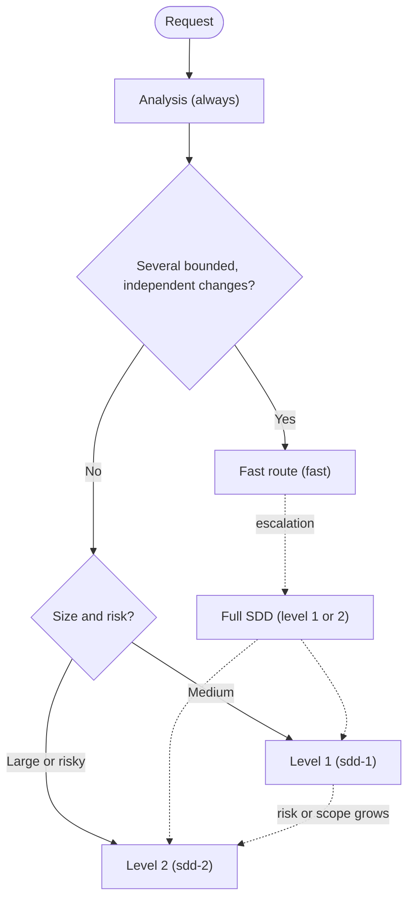
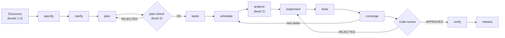

# The SDD Model · SddOrch — Overview

> A **generic, reusable** document: it describes the method, not just its
> implementation in this repo. It works as a reference to adopt it in any
> project.

## What it is

**SDD (Spec-Driven Development)** is a method where the *contract* is written
before the code: a constitution with non-negotiable principles, a specification
of the *what* and the *why*, a technical plan, a task breakdown, and only then,
implementation.

On top of that method, **SddOrch** is an orchestrator: an agent that
**discovers** the problem, **understands** the terrain from several disciplines,
chains the Spec-Kit phases, delegates to specialized subagents, and keeps scope,
quality, and memory under control. It does not reimplement Spec-Kit: it
**drives** it.

```text
        ┌──────────────────────────────────────────────────────┐
        │                       SddOrch                          │
        │   (orchestrator: discovers, plans, delegates, verifies)│
        └───┬───────────────┬───────────────┬───────────┬───────┘
            │               │               │           │
     researchers       general         implementer   reviewer/tester/release
   (code/market)+writer (commands)     (writes code)     (gates & release)
```

## Principles of the model

1. **Spec-Kit is untouched.** The commands (`speckit.*`), scripts, templates,
   and constitution are off-limits. SddOrch *reads* and executes them to the
   letter.
2. **Delegation with a contract.** Every subagent gets a minimal prompt (paths,
   IDs, `writes`, mode) and always returns the same format. **No subagent asks
   the user:** doubts come back as `preguntas_abiertas` and the orchestrator
   centralizes them into **one** question.
3. **Pointers, not content.** Long reports live in memory (Engram); agents pass
   the key and a short summary. The orchestrator's context stays small.
4. **Verified scope.** Every subagent writes **only** to the files declared to
   it (`writes`). The orchestrator checks the real result against what was
   declared.
5. **Constitution gates.** Before implementation (optional) and after
   convergence, a reviewer validates against the principles. A `REJECTED` sends
   the flow back with feedback.
6. **Safe parallelism.** Several subagents share the same working tree; a
   planner guarantees they never write to the same file at once.
7. **Discovery by discipline.** Before specifying, the request is investigated
   from roles (product, UX, security, performance, quality, accessibility) and a
   PRD and an RFC are written.
8. **Persistent memory.** Flow state lives outside the model's context: an
   interrupted flow resumes without losing the thread.
9. **Continuous improvement.** Subagents report *harness* friction and the
   orchestrator proposes permanent improvements at the end. See
   [`06-auto-learning.md`](06-auto-learning.md).

## Three execution routes

SddOrch picks the lightest route that solves the request. Analysis is **always**
mandatory; what changes is how much documentation and how many gates there are.

| Route | When | Documents | Discovery |
|---|---|---|---|
| **Fast** (`fast`) | Several bounded, independent changes (e.g. UX tweaks in different files), no new contracts or data | A table of **units** (no `spec`/`plan`/`tasks`) | Only if there are 4+ units with uncertain files |
| **Level 1** (`sdd-1`) | Medium feature | **One-page** PRD and RFC | Short: 2–3 roles |
| **Level 2** (`sdd-2`) | Large or risky feature | **Full** PRD and RFC | Up to 5 roles; marketing or legal only here and if the user asks |

The fast route **escalates to full SDD** if a unit needs new contracts, data, or
dependencies; if units depend on each other so they cannot be ordered by files;
if there are more than `FAST_MAX_UNITS` (15 by default); or if consistency
reveals an ambiguous request.



## The phase pipeline

```text
[discovery] → specify → clarify → plan → [plan-check] → tasks → schedule
            → analyze → implement → tests → converge → [code-review]
            → verify → release
```

**The same flow as a diagram (Mermaid):**



- `[discovery]` is the researchers + writer (the fast route uses its analysis).
- `[plan-check]` and `[code-review]` are **constitution gates**.
- `schedule`, `verify`, and `release` are SddOrch's own phases.
- On the **fast route** the pipeline is shorter:
  `analysis → consistency → [gate in Plan] → implement by waves → tests → [code-review] → verify → release`.
- Details for each phase in [`02-phases.md`](02-phases.md).

## Two execution modes

| | **Plan** | **Auto** |
|---|---|---|
| User gates | After each initial and discovery phase | None |
| From `tasks` onward | Chains without asking | Chains without asking |
| When it fits | Complex, ambiguous, or risky changes | Simple, bounded changes (fast route or level 1) |
| On a blocker | Asks how to proceed | Stops and returns to Plan |

In both modes there are actions that are **never automatic**: `git push`,
opening a PR, deleting files, changing the constitution, adding new
dependencies, and resolving an inconsistency that changes the request's scope.

## Subagents

| Subagent | Role | Writes code |
|---|---|---|
| `sddorch-researcher-code` | Investigates a technical role (UX, security, performance, quality, accessibility) with repo access | No |
| `sddorch-researcher-market` | Investigates product (and marketing or legal) with web access and no code access | No |
| `sddorch-writer` | Writes the PRD and RFC from the reports in Engram | No |
| `general` | Runs the `plan`, `tasks`, `analyze`, `converge` commands | Per command |
| `sddorch-implementer` | Runs `implement` tasks or a fast-route unit | Yes |
| `sddorch-reviewer` | Constitution gates (`plan-check`, `code-review`) | No |
| `sddorch-tester` | Tests after `implement` | Specs only |
| `sddorch-release` | Commits, `pr-detail`, and PR | No (git) |

Full catalog in [`04-subagents.md`](04-subagents.md). The **roles** that guide
investigation are in [`09-roles.md`](09-roles.md).

## Why this model (advantages)

- **Fewer surprises:** discovery by discipline catches scope, reuse, risks, and
  requirements **before** touching code.
- **Informed decisions:** every role brings evidence (`file:line` or a cited
  source) and conflicts between areas are reconciled explicitly.
- **Traceability:** everything lands in artifacts (PRD, RFC, spec, plan, tasks)
  and in persistent memory.
- **Speed without chaos:** real parallelism in research and implementation, with
  guarantees subagents do not step on each other.
- **Quality by gate, not by good will:** the constitution is validated
  automatically at fixed points.
- **It sharpens itself:** the harness-signal loop turns repeated friction into
  permanent infrastructure.
- **Resumable:** an interrupted flow resumes from the last completed phase, not
  from scratch.

## SDD track index

1. [Overview](01-overview.md) — this document
2. [Phases and gates](02-phases.md)
3. [Discovery: researchers and writer](03-discovery.md)
4. [Subagents and contract](04-subagents.md)
5. [Wave scheduling](05-scheduling.md)
6. [Self-learning (harness signals)](06-auto-learning.md)
7. [Memory and resumption](07-memory.md)
8. [Skills catalog](08-skills.md)
9. [Discovery roles](09-roles.md)
10. [FAQ](10-faq.md)
