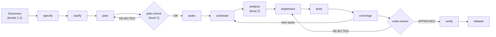
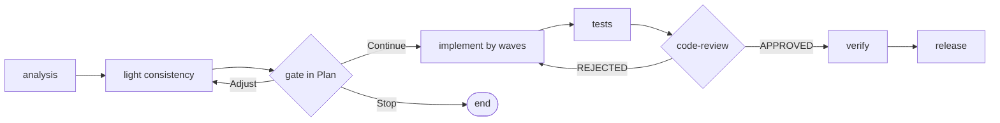

# Phases and gates

The full SddOrch pipeline adds, on top of the Spec-Kit phases, a **discovery**
stage and the orchestrator's own phases. Each Spec-Kit phase is run by reading
the corresponding command (`.opencode/commands/speckit.<phase>.md`) **to the
letter**.

```text
[discovery] → specify → clarify → plan → [plan-check] → tasks → schedule
            → analyze → implement → tests → converge → [code-review]
            → verify → release
```

**Diagram (Mermaid):**



> `analyze` and `plan-check` only appear in the complex flow (level 2).
> The **fast route** has its own pipeline: see below.

## Where each phase runs

A key decision of the model: **not everything runs in the orchestrator's
context**. Phases that interact with the user run in its context; mechanical
ones are delegated to a `general` subagent to keep the orchestrator's window
clean of long artifacts.

| Context | Phases |
|---|---|
| **Orchestrator** (asks the user) | discovery (centralizes questions), `specify`, `clarify`, `schedule`, `implement`, `tests`, `verify`, `release` |
| **`general` subagent** | `plan`, `tasks`, `analyze`, `converge` |

## Discovery (before `specify`)

A pre-Spec-Kit stage where the orchestrator gathers the knowledge of each
discipline **without loading its context**. Full detail in
[`03-discovery.md`](03-discovery.md). In short:

1. Select the relevant **roles** (max `MAX_PARALLEL_RESEARCH`).
2. Launch the **researchers** in parallel (`-market` for product, `-code` for
   the rest); each saves its report in Engram and returns a summary.
3. **Centralize** the open questions in a single `question` call.
4. Save each **decision** in its key, when it is taken.
5. The **writer** produces the **PRD** and the **RFC** from the reports.
6. Review the PRD and start `specify` with the PRD as input.

## Fast route

For requests that are several bounded, independent changes. It keeps the
analysis, consistency, and parallelism, but **without Spec-Kit documents**:

```text
analysis → consistency → [gate in Plan] → implement by waves
        → tests → [code-review] → verify → release
```

**Diagram (Mermaid):**



1. **Decomposition:** a table of **units** (`U1..Un`: description, `writes`,
   done criterion, dependencies).
2. **Light consistency:** contradictions, ambiguity, and signals that the
   request actually needs contracts or data (then it escalates to full SDD).
3. **Waves:** same rules as `schedule` (units without shared files).
4. **Implementation:** one `sddorch-implementer` per unit, in parallel.
5. **Closing:** `tests`, `code-review`, `verify`, `release`.

## Phase by phase (full SDD)

### `specify`
Produces `spec.md`: the *what* and the *why*. Its input is the discovery
**PRD**.

### `clarify` — always (full SDD)
Always runs, right after `specify`, in both modes. The **fast route does not use
it** (it has its own light consistency). It detects inconsistencies:
contradictions, incomplete requirements, fuzzy scope, unconfirmed assumptions.

- **Minor inconsistency** (can be assumed without changing scope): the
  orchestrator resolves it, records the assumption, and moves on.
- **Blocking inconsistency**: stops and asks.

In Auto mode it does not ask about minor things; only on a blocking
inconsistency.

### `plan`
Produces `plan.md` (plus `research.md`, `data-model.md`, `contracts/` as
needed). Its technical input is the **RFC**.

### `plan-check` — gate (level 2 only)
The `sddorch-reviewer` evaluates `plan.md` against the constitution and returns
`OK`, `RISK`, or `VIOLATION` per principle. A `VIOLATION` equals `REJECTED` and
sends the flow back to `plan`.

### `tasks`
Produces `tasks.md`: numbered tasks (`T001`, `T002`…) by user story, with paths,
a `[P]` mark, and dependencies.

### `schedule` — SddOrch's own phase
Turns `tasks.md` into **safe parallel waves**. Detail in
[`05-scheduling.md`](05-scheduling.md).

### `analyze` (level 2 only)
Checks consistency across artifacts (`spec` ↔ `plan` ↔ `tasks`). Critical
findings stop Auto mode.

### `implement`
Runs the tasks wave by wave, with several `sddorch-implementer` in parallel. At
the end of each wave:
1. verify scope (`git status` against the `writes`),
2. mark `[X]` in `tasks.md` (only the orchestrator writes that file),
3. save state.

**Failures:** single retry with the error as context; if it persists, dependent
tasks are marked blocked. `implement` **never** runs `git add` or `commit`.

### `tests`
The `sddorch-tester` writes real-rule tests (Vitest) only under `specs/`,
without touching product code. If a test fails because the code is wrong, it
reports a blocker and goes back to `implement`.

### `converge`
Looks for gaps between what was specified and what was implemented. If it adds
tasks, `schedule → implement` repeats only for them. It stops when no tasks
remain or when it reaches `MAX_CONVERGE_CYCLES` (2 by default).

### `code-review` — gate
The `sddorch-reviewer` loads the `code-reviewer` skill and applies its checklist
to the modified files. `REJECTED` only for documented standard violations.

### `verify` — SddOrch's own phase
Runs the `VERIFY_COMMANDS` in order (`pnpm lint`, `pnpm tsc`, `pnpm test`,
`pnpm build`) and summarizes. If something fails, it asks: fix, continue
anyway, or stop.

### `release` — SddOrch's own phase
With `sddorch-release`: (1) `commits` mode, (2) `pr-detail` mode; (3) `open-pr`
mode **only with explicit confirmation**. The push is done only by the PR
script.

## Gates summary

| Gate | When | Who | Effect of `REJECTED` |
|---|---|---|---|
| `plan-check` | After `plan` (level 2) | `sddorch-reviewer` | Back to `plan` |
| `code-review` | After `converge` (or fast-route closing) | `sddorch-reviewer` | Back to the previous phase |

## Actions that are never automatic

Not even in Auto mode:

- `git push` and opening the PR;
- deleting files;
- changing the constitution;
- adding new dependencies;
- resolving an inconsistency that changes the request's scope.
