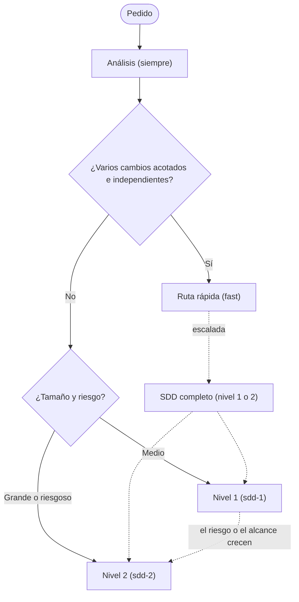
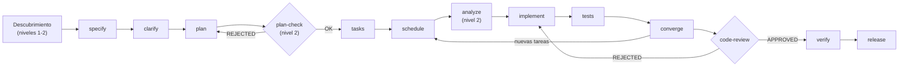

# El modelo SDD · SddOrch — Visión general

> Documento **genérico y reutilizable**: describe el método, no solo su
> implementación en este repo. Sirve como referencia para adoptarlo en
> cualquier proyecto.

## Qué es

**SDD (Spec-Driven Development)** es un método de desarrollo donde el
*contrato* se escribe antes que el código: una constitución con principios
no negociables, una especificación del *qué* y el *por qué*, un plan técnico,
un desglose de tareas y, recién entonces, implementación.

Sobre ese método, **SddOrch** es un orquestador: un agente que **descubre** el
problema, **conoce** el terreno desde varias disciplinas, encadena las fases de
Spec-Kit, delega en subagentes especializados y mantiene control de alcance,
calidad y memoria. No reimplementa Spec-Kit: **lo conduce**.

```text
        ┌──────────────────────────────────────────────────────┐
        │                       SddOrch                          │
        │   (orquestador: descubre, planifica, delega, verifica) │
        └───┬───────────────┬───────────────┬───────────┬───────┘
            │               │               │           │
     researchers       general         implementer   reviewer/tester/release
   (code/market)+writer (comandos)     (escribe código)  (compuertas y cierre)
```

## Principios del modelo

1. **No se toca Spec-Kit.** Los comandos (`speckit.*`), scripts, plantillas y
   la constitución son intocables. SddOrch los *lee* y los ejecuta al pie de
   la letra.
2. **Delegación con contrato.** Cada subagente recibe un prompt mínimo (rutas,
   IDs, `writes`, modo) y devuelve siempre el mismo formato. **Ningún subagente
   pregunta al usuario:** las dudas se devuelven como `preguntas_abiertas` y el
   orquestador las centraliza en **una sola** pregunta.
3. **Punteros, no contenido.** Los informes largos viven en memoria (Engram);
   los agentes se pasan la clave y un resumen corto. El contexto del
   orquestador se mantiene pequeño.
4. **Alcance verificado.** Cada subagente escribe **solo** en los archivos que
   se le declaran (`writes`). El orquestador contrasta el resultado real contra
   lo declarado.
5. **Compuertas de constitución.** Antes de implementar (opcional) y después de
   converger, un revisor valida contra los principios. Un `REJECTED` devuelve a
   la fase anterior con feedback.
6. **Paralelismo seguro.** Varios subagentes comparten el mismo árbol de
   trabajo; un planificador garantiza que nunca escriban el mismo archivo a la
   vez.
7. **Descubrimiento por disciplinas.** Antes de especificar, se investiga el
   pedido desde roles (producto, UX, seguridad, rendimiento, calidad,
   accesibilidad) y se redacta un PRD y un RFC.
8. **Memoria persistente.** El estado del flujo vive fuera del contexto del
   modelo: un flujo interrumpido se reanuda sin perder el hilo.
9. **Mejora continua.** Los subagentes reportan fricciones del *harness* y el
   orquestador propone mejoras permanentes al cierre. Ver
   [`06-auto-learning.md`](06-auto-learning.md).

## Tres rutas de ejecución

SddOrch elige la ruta más liviana que resuelva el pedido. El análisis es
**siempre** obligatorio; lo que cambia es cuánto documento y cuántas compuertas
hay.

| Ruta | Cuándo | Documentos | Descubrimiento |
|---|---|---|---|
| **Rápida** (`fast`) | Varios cambios acotados e independientes (p. ej. ajustes de UX en archivos distintos), sin contratos ni datos nuevos | Tabla de **unidades** (sin `spec`/`plan`/`tasks`) | Solo si hay 4+ unidades de archivos inciertos |
| **Nivel 1** (`sdd-1`) | Feature mediana | PRD y RFC de **una página** | Corto: 2–3 roles |
| **Nivel 2** (`sdd-2`) | Feature grande o con riesgo | PRD y RFC **completos** | Hasta 5 roles; marketing o legal solo aquí y si el usuario los pide |

La ruta rápida **escala a SDD completo** si una unidad necesita contratos,
datos o dependencias nuevas; si las unidades dependen entre sí de forma que no
se pueden ordenar por archivos; si hay más de `FAST_MAX_UNITS` (15 por defecto);
o si la consistencia revela un pedido ambiguo.



## El pipeline de fases

```text
[descubrimiento] → specify → clarify → plan → [plan-check] → tasks → schedule
                 → analyze → implement → tests → converge → [code-review]
                 → verify → release
```

**El mismo flujo como diagrama (Mermaid):**



- `[descubrimiento]` son los researchers + writer (ruta rápida usa su análisis).
- `[plan-check]` y `[code-review]` son **compuertas de constitución**.
- `schedule`, `verify` y `release` son fases propias de SddOrch.
- En la **ruta rápida** el pipeline es más corto:
  `análisis → consistencia → [compuerta] → implement por olas → tests → [code-review] → verify → release`.
- Detalle de cada fase en [`02-phases.md`](02-phases.md).

## Dos modos de ejecución

| | **Plan** | **Auto** |
|---|---|---|
| Compuertas al usuario | Tras cada fase inicial y del descubrimiento | Ninguna |
| Desde `tasks` en adelante | Encadena sin preguntar | Encadena sin preguntar |
| Cuándo conviene | Cambios complejos, ambiguos o riesgosos | Cambios simples y acotados (ruta rápida o nivel 1) |
| Ante un bloqueo | Pregunta cómo seguir | Frena y vuelve a Plan |

En ambos modos hay acciones que **nunca son automáticas**: `git push`, abrir un
PR, borrar archivos, cambiar la constitución, agregar dependencias nuevas y
resolver una inconsistencia que cambie el alcance del pedido.

## Subagentes

| Subagente | Rol | Escribe código |
|---|---|---|
| `sddorch-researcher-code` | Investiga un rol técnico (UX, seguridad, rendimiento, calidad, accesibilidad) con acceso al repo | No |
| `sddorch-researcher-market` | Investiga producto (y marketing o legal) con web y sin acceso al código | No |
| `sddorch-writer` | Redacta el PRD y el RFC desde los informes en Engram | No |
| `general` | Ejecuta los comandos `plan`, `tasks`, `analyze`, `converge` | Según comando |
| `sddorch-implementer` | Ejecuta tareas de `implement` o una unidad de la ruta rápida | Sí |
| `sddorch-reviewer` | Compuertas de constitución (`plan-check`, `code-review`) | No |
| `sddorch-tester` | Tests tras `implement` | Solo specs |
| `sddorch-release` | Commits, `pr-detail` y PR | No (git) |

Catálogo completo en [`04-subagents.md`](04-subagents.md). Los **roles** que
guían la investigación están en [`09-roles.md`](09-roles.md).

## Por qué este modelo (ventajas)

- **Menos sorpresas:** el descubrimiento por disciplinas detecta alcance,
  reutilización, riesgos y requisitos **antes** de tocar código.
- **Decisiones informadas:** cada rol aporta evidencia (`archivo:línea` o
  fuente citada) y los conflictos entre áreas se concilian explícitamente.
- **Trazabilidad:** todo queda en artefactos (PRD, RFC, spec, plan, tasks) y en
  memoria persistente.
- **Velocidad sin caos:** paralelismo real de investigación e implementación,
  con garantías de que los subagentes no se pisan.
- **Calidad por compuerta, no por buena voluntad:** la constitución se valida
  automáticamente en puntos fijos.
- **Se afila solo:** el ciclo de señales de harness convierte la fricción
  repetida en infraestructura permanente.
- **Reanudable:** un flujo interrumpido se retoma desde la última fase
  terminada, no desde cero.

## Índice del track SDD

1. [Visión general](01-overview.md) — este documento
2. [Fases y compuertas](02-phases.md)
3. [Descubrimiento: researchers y writer](03-discovery.md)
4. [Subagentes y contrato](04-subagents.md)
5. [Planificación de tandas](05-scheduling.md)
6. [Auto-aprendizaje (harness signals)](06-auto-learning.md)
7. [Memoria y reanudación](07-memory.md)
8. [Catálogo de skills](08-skills.md)
9. [Roles del descubrimiento](09-roles.md)
10. [Preguntas frecuentes](10-faq.md)
