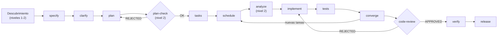
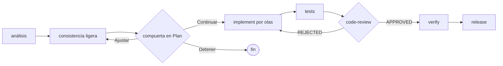

# Fases y compuertas

El pipeline completo de SddOrch suma, además de las fases de Spec-Kit, una etapa
de **descubrimiento** y fases propias del orquestador. Cada fase de Spec-Kit se
ejecuta leyendo el comando correspondiente
(`.opencode/commands/speckit.<fase>.md`) **al pie de la letra**.

```text
[descubrimiento] → specify → clarify → plan → [plan-check] → tasks → schedule
                 → analyze → implement → tests → converge → [code-review]
                 → verify → release
```

**Diagrama (Mermaid):**



> `analyze` y `plan-check` solo aparecen en el flujo complejo (nivel 2).
> La **ruta rápida** tiene su propio pipeline: ver más abajo.

## Dónde corre cada fase

Una decisión clave del modelo: **no todo corre en el contexto del orquestador**.
Las fases que interactúan con el usuario lo hacen en su contexto; las mecánicas
se delegan a un subagente `general` para no ensuciar la ventana del orquestador
con artefactos largos.

| Contexto | Fases |
|---|---|
| **Orquestador** (pregunta al usuario) | descubrimiento (centraliza preguntas), `specify`, `clarify`, `schedule`, `implement`, `tests`, `verify`, `release` |
| **Subagente `general`** | `plan`, `tasks`, `analyze`, `converge` |

## Descubrimiento (antes de `specify`)

Etapa previa a Spec-Kit, en la que el orquestador reúne el conocimiento de cada
disciplina **sin cargar su contexto**. Detalle completo en
[`03-discovery.md`](03-discovery.md). En resumen:

1. Selecciona los **roles** relevantes (máx. `MAX_PARALLEL_RESEARCH`).
2. Lanza en paralelo los **researchers** (`-market` para producto, `-code` para
   el resto); cada uno guarda su informe en Engram y devuelve un resumen.
3. **Centraliza** las preguntas abiertas en una sola llamada a `question`.
4. Guarda cada **decisión** en su clave, en el momento.
5. El **writer** redacta el **PRD** y el **RFC** desde los informes.
6. Revisa el PRD y arranca `specify` con el PRD como entrada.

## Ruta rápida

Para pedidos que son varios cambios acotados e independientes. Mantiene el
análisis, la consistencia y el paralelismo, pero **sin documentos de Spec-Kit**:

```text
análisis → consistencia → [compuerta en Plan] → implement por olas
        → tests → [code-review] → verify → release
```

**Diagrama (Mermaid):**



1. **Descomposición:** de una tabla de **unidades** (`U1..Un`: descripción,
   `writes`, criterio de hecho, dependencias).
2. **Consistencia ligera:** contradicciones, ambigüedad y señales de que el
   pedido en realidad exige contratos o datos (entonces escala a SDD completo).
3. **Olas:** mismas reglas que `schedule` (unidades sin archivos en común).
4. **Implementación:** un `sddorch-implementer` por unidad, en paralelo.
5. **Cierre:** `tests`, `code-review`, `verify`, `release`.

## Detalle fase por fase (SDD completo)

### `specify`
Produce `spec.md`: el *qué* y el *por qué*. Su entrada es el **PRD** del
descubrimiento.

### `clarify` — siempre (SDD completo)
Corre siempre, justo detrás de `specify`, en los dos modos. La **ruta rápida no
lo usa** (tiene su propia consistencia ligera). Detecta inconsistencias:
contradicciones, requisitos incompletos, alcance difuso, supuestos sin
confirmar.

- **Inconsistencia menor** (se puede asumir sin cambiar el alcance): la resuelve
  el orquestador, deja constancia del supuesto y sigue.
- **Inconsistencia bloqueante**: frena y pregunta.

En modo Auto no se pregunta por lo menor; solo ante una inconsistencia
bloqueante.

### `plan`
Produce `plan.md` (y `research.md`, `data-model.md`, `contracts/` según haga
falta). Su entrada técnica es el **RFC**.

### `plan-check` — compuerta (solo nivel 2)
El `sddorch-reviewer` evalúa `plan.md` contra la constitución y devuelve `OK`,
`RIESGO` o `VIOLACIÓN` por principio. Una `VIOLACIÓN` equivale a `REJECTED` y
devuelve a `plan`.

### `tasks`
Produce `tasks.md`: tareas numeradas (`T001`, `T002`…) por historia de usuario,
con rutas, marca `[P]` y dependencias.

### `schedule` — fase propia de SddOrch
Convierte `tasks.md` en **tandas** (olas) de ejecución paralela segura. Detalle
en [`05-scheduling.md`](05-scheduling.md).

### `analyze` (solo nivel 2)
Revisa consistencia entre artefactos (`spec` ↔ `plan` ↔ `tasks`). Hallazgos
críticos detienen el modo Auto.

### `implement`
Ejecuta las tareas por tandas, con varios `sddorch-implementer` en paralelo. Al
terminar cada tanda:
1. verifica el alcance (`git status` contra los `writes`),
2. marca `[X]` en `tasks.md` (solo el orquestador escribe ese archivo),
3. guarda el estado.

**Fallos:** reintento único con el error como contexto; si persiste, se marcan
como bloqueadas las tareas dependientes. `implement` **nunca** hace `git add`
ni `commit`.

### `tests`
El `sddorch-tester` escribe tests de reglas reales (Vitest) solo en `specs/`,
sin tocar código de producto. Si un test falla por código incorrecto, lo reporta
como bloqueo y vuelve a `implement`.

### `converge`
Busca brechas entre lo especificado y lo implementado. Si agrega tareas, repite
`schedule → implement` solo con ellas. Para al no quedar tareas o al llegar a
`MAX_CONVERGE_CYCLES` (2 por defecto).

### `code-review` — compuerta
El `sddorch-reviewer` carga la skill `code-reviewer` y aplica su checklist sobre
los archivos modificados. `REJECTED` solo por incumplimientos de estándares
documentados.

### `verify` — fase propia de SddOrch
Ejecuta en orden los `VERIFY_COMMANDS` (`pnpm lint`, `pnpm tsc`, `pnpm test`,
`pnpm build`) y resume. Si algo falla, se pregunta: corregir, continuar
igualmente o detener.

### `release` — fase propia de SddOrch
Con `sddorch-release`: (1) modo `commits`, (2) modo `pr-detail`; (3) modo
`open-pr` **solo con confirmación explícita**. El push lo hace únicamente el
script de PR.

## Resumen de compuertas

| Compuerta | Cuándo | Quién | Efecto de `REJECTED` |
|---|---|---|---|
| `plan-check` | Tras `plan` (nivel 2) | `sddorch-reviewer` | Vuelve a `plan` |
| `code-review` | Tras `converge` (o cierre de ruta rápida) | `sddorch-reviewer` | Vuelve a la fase anterior |

## Acciones que nunca son automáticas

Ni siquiera en modo Auto:

- `git push` y abrir el PR;
- borrar archivos;
- cambios en la constitución;
- agregar dependencias nuevas;
- resolver una inconsistencia que cambie el alcance del pedido.
