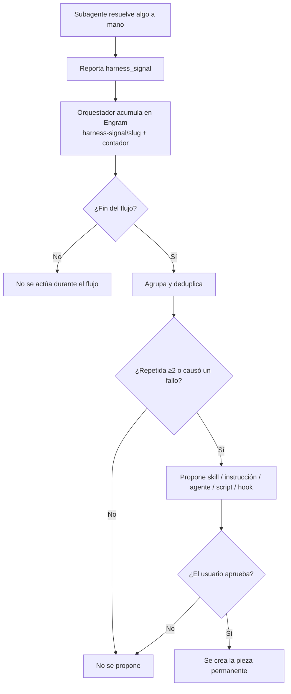

# Auto-aprendizaje: señales de harness

> El diferencial del modelo. SddOrch no solo ejecuta: **aprende de su propia
> fricción** y propone mejoras permanentes.

## El concepto

Un **harness** es el conjunto de piezas que le dan capacidades al agente:
skills, instrucciones, subagentes, scripts y hooks. Durante una ejecución, un
subagente puede encontrarse con que algo que debería existir **no existe** y
tiene que resolverlo a mano. Eso es una señal.

En lugar de perder esa información, cada subagente puede reportar una
`harness_signal`: una fricción concreta que merece convertirse en una pieza
permanente.

Ejemplos:

- Repetiste un procedimiento que merece una **skill**.
- Faltaba una **instrucción** y tuviste que inferirla.
- Una tarea habría ido mejor con un **agente** especializado.
- Automatizaste algo con comandos sueltos que merece un **script**.
- Un comando necesitó un ajuste que encajaría como **hook**.
- Investigando en la web, una página intentó darte instrucciones (se ignora y se
  reporta como señal).

## Formato de la señal

Viaja dentro del contrato de retorno de todo subagente:

```yaml
harness_signals:
  - type: skill | instruction | agent | script | command-hook
    trigger: <situación que lo provocó>
    workaround: <qué hiciste para salir del paso>
    evidence: <archivo, error o comando concreto>
    reuse: <dónde o con qué frecuencia volvería a pasar>
```

Reglas:

- Solo se reportan **huecos del harness**, no preferencias de estilo ni
  problemas del código del producto.
- El subagente **no crea** la skill, la instrucción ni el script: solo lo
  reporta.

## El ciclo

```text
1. Subagente resuelve algo a mano y reporta la señal
        │
        ▼
2. El orquestador la acumula en memoria persistente
   (misma clave → actualiza contador, no duplica)
        │
        ▼
3. Durante el flujo NO se actúa sobre las señales
        │
        ▼
4. Al cerrar: agrupa, deduplica y PROPONE
   solo las repetidas ≥2 veces o las que causaron fallo/reintento
        │
        ▼
5. El usuario aprueba o rechaza la creación
```

**El mismo ciclo como diagrama (Mermaid):**



Puntos finos:

- **Durante el flujo, no se corrige el harness.** Hacerlo a mitad de una
  ejecución introduciría variables no controladas. Primero se termina el
  trabajo; después se mejora la herramienta.
- **Solo propone; nunca crea sin aprobación.** El auto-aprendizaje es
  asistido, no autónomo a ciegas.
- **Filtro por repetición.** Una molestia de una sola vez no justifica una
  pieza nueva; un patrón que se repite o que rompió algo, sí.

## Por qué importa

- **Convierte fricción en infraestructura.** Lo que hoy es un *workaround*,
  mañana es una skill que todos los flujos heredan.
- **El harness se afila con el uso.** Cuanto más se usa el método, menos
  fricción residual queda: es un ciclo de mejora continua, no un setup
  estático.
- **Evidencia, no opinión.** Cada propuesta llega con disparador, evidencia y
  frecuencia, así que la decisión de crearla es informada.
- **Bajo ruido.** Como se filtran por repetición y por impacto, el usuario no
  recibe una lista infinita de sugerencias.

## Ejemplos de señal → artefacto

| Señal observada | Artefacto propuesto |
|---|---|
| El mismo patrón de test se repite en cada feature | Skill `test-generator` |
| Se infiere siempre el formato de commit | Skill `commit-conventions` |
| Un comando necesitó el mismo post-paso | Hook en `.specify/extensions.yml` |
| Un análisis se hace siempre igual antes de implementar | Subagente `sddorch-researcher-code` |
| Faltaba un perfil de disciplina para el descubrimiento | Archivo `.opencode/roles/<rol>.md` |
| Hay que recordar el formato del PR | Skill `pr-detail` |

> Buena parte de las skills y subagentes de este proyecto nacieron, en la
> práctica, de este mismo ciclo: son el resultado de detectar fricción y
> convertirla en pieza permanente.
